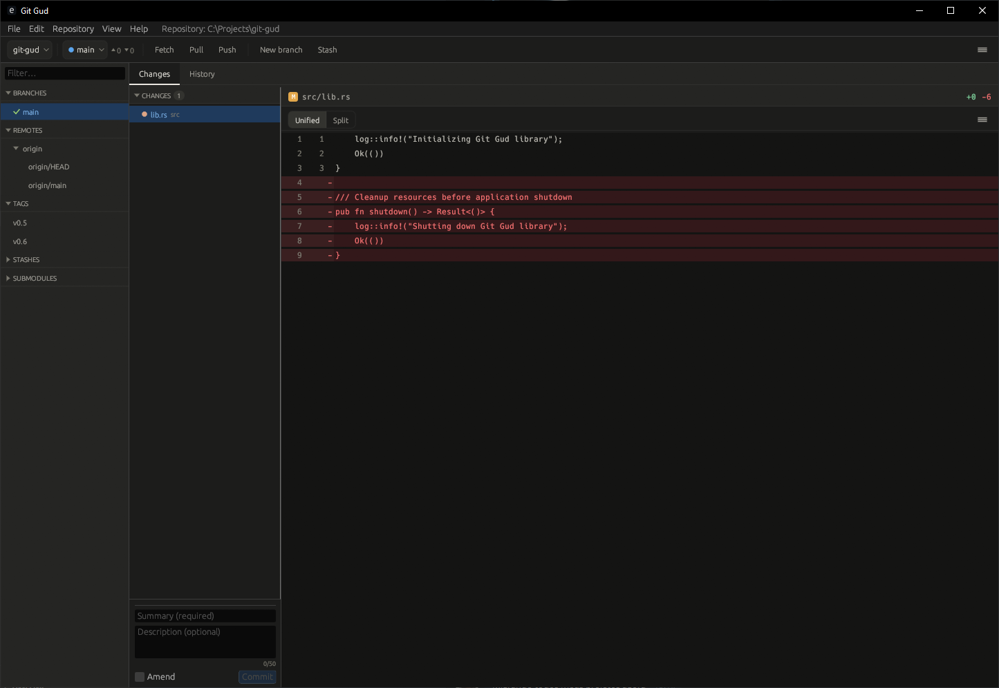
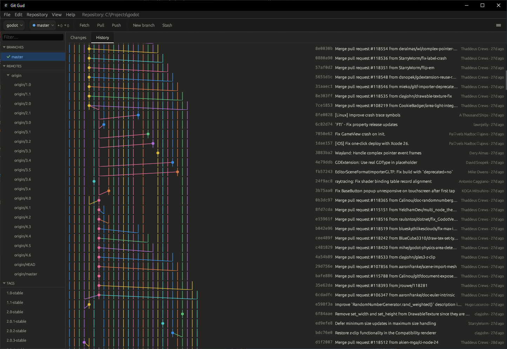

# Git Gud

A fast, native Git GUI for everyday use — built with Rust and egui. Designed around the
staging-and-committing workflow with a clean three-panel layout and full keyboard support.

## Screenshots

### Diff View


### Commit Graph


## What it does

**Stage and commit without leaving the keyboard.** Select files, hit Space to stage, write
your message, and commit with Ctrl+Enter. The diff panel updates as you move through the file
list so you always see exactly what you're committing.

**Pull, push, and fetch with live progress.** Network operations stream output line-by-line so
you can see what's happening. SSH keys, agents, and HTTPS credential helpers all work through
your system git — nothing to configure inside the app.

**See the full picture in the history graph.** The History tab shows commits from all branches
in a lane-based graph. Switch branches in the sidebar to highlight which commits belong to it.
Right-click any commit to cherry-pick it or copy its hash.

**Manage branches without the command line.** Create, rename, delete, checkout, or merge
branches from the sidebar. Tags work the same way — create and push to origin in two clicks.

**Detect merge conflicts at a glance.** Conflicted files appear in the Changes panel with a
red badge. An inline resolver with Accept Ours / Accept Theirs buttons per conflict hunk is
in active development.

**Stash and unstash instantly.** Right-click any stash entry to pop or drop it.

**Manage worktrees from the sidebar.** The Worktrees section lists all git worktrees; right-click
to remove or use the "Add Worktree" dialog to create one at a custom path and branch.

**Switch repositories in one click.** Click the repository pill in the toolbar to open a
dropdown of recent repos, or open any folder as a new repository.

**Initialize new repositories.** Repository → New Repository... picks a folder and runs `git init`.

**Auto-refreshes when you work outside the app.** A file watcher picks up changes made by
other tools and updates the UI automatically.

## Keyboard Shortcuts

| Shortcut | Action |
|----------|--------|
| `Ctrl+Shift+F` | Fetch |
| `Ctrl+Shift+L` | Pull |
| `Ctrl+Shift+P` | Push |
| `Ctrl+R` | Refresh |
| `Ctrl+Enter` | Commit |
| `↑` / `↓` | Navigate file list |
| `Space` | Stage / unstage selected file |
| `Enter` | Checkout selected branch |
| `C` | Cherry-pick selected commit |

## Requirements

- [Rust](https://rustup.rs) stable (1.75+)
- Git installed and on `PATH`

## Build

```powershell
cargo build --release
```

The binary lands at `target/release/git-gud.exe` (Windows) or `target/release/git-gud`
(macOS/Linux).

## Run

```powershell
# Open with the file-chooser dialog
cargo run

# Open a specific repository directly
cargo run -- /path/to/repo
```

## Development

```powershell
cargo check       # fast type-check
cargo test        # 126 tests
cargo clippy      # lint
```

Tests use temporary Git repositories — no side effects on the real filesystem.

## Tech Stack

| Crate | Purpose |
|-------|---------|
| `eframe` / `egui` 0.27 | Immediate-mode GUI |
| `git2` 0.20 | Git operations |
| `syntect` 5.3 | Syntax highlighting |
| `notify` 6.1 | File system watcher |
| `parking_lot` 0.12 | Mutex |
| `rfd` 0.14 | Native file dialogs |
| `dirs` 5.0 | Platform config directory |
| `anyhow` 1.0 | Error handling |

## Roadmap

| Feature | Notes |
|---------|-------|
| Merge conflict resolver | Inline Accept Ours / Accept Theirs per conflict hunk |
| Word-level diff | Highlight changed words inside modified lines |
| File history | `git log -- <file>` panel for per-file commit history |
| Interactive rebase | Squash, fixup, reorder commits |
| Remote management | Add/edit/remove remotes from the UI |
| Diff search | Find text within the diff viewer |

## License

TBD
